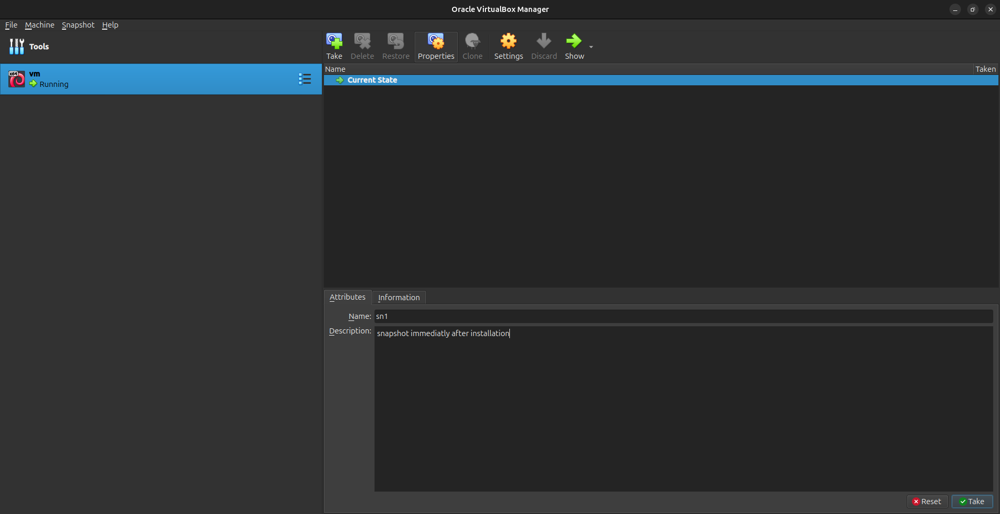
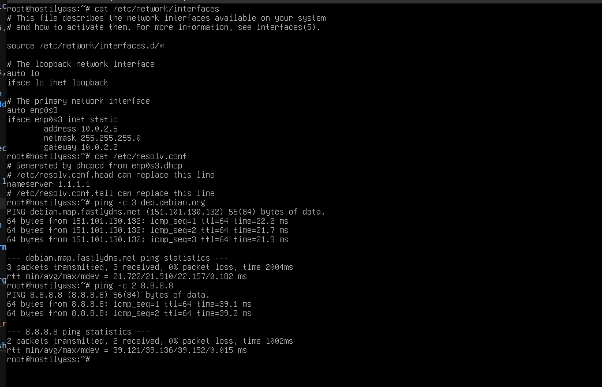
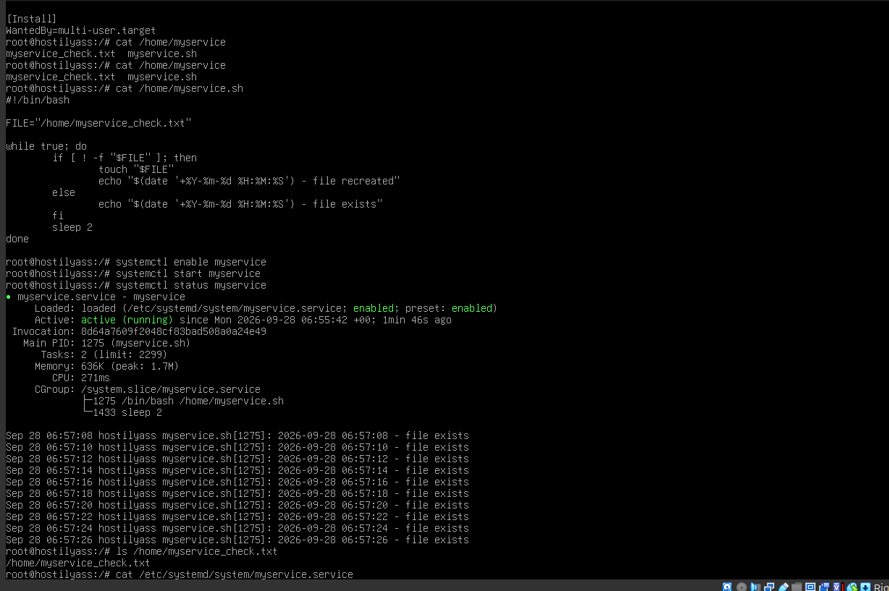
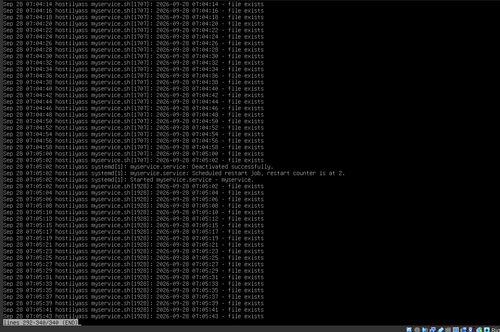

This linux consists of installing and configuring a minimal Debian
server in a VirtualBox (VM).     
the server is configured with: 
   * no desktop environment      
   * LVM storage  
   * separate logical volumes for `/`, `/home`, `/var` and swap   
   * a static IPv4 address 
   * DNS configuration  
   * a custom continuously running `systemd` service
   * persistent service logs in the system journal
   * boot-time analysis with `systemd-analyze`

the goal of this document is to provide a reproducible runbook that other poeple can follow to rebuild the same server.

## Installation   

   this is step by step, the installation process used as the base for this linux project.    
   * install VirtualBox
   * download the [Debian ISO](https://www.debian.org/download) (netinst minimal image)
   * create a new VM (Name: `vm`, Type: Linux, Version: Debian 64-bit)
   * attach the Debian ISO and check "Skip Unattended Installation"
   * allocate at least 1-2 GB RAM and a virtual disk of at least 20-25 GB
   * start the VM and boot from the Debian ISO
   * select the installation language (English)
   * configure the location (United States)
   * configure the locale (`en_US.UTF-8`)
   * configure the keyboard keymap (French)
   * configure the network:
      - enter hostname: `hostilyass`
      - leave domain name empty
   * set the root password
   * create the normal user account:
      - full name: `ilyass`
      - username: `ilyass`
      - set the user password
   * configure the clock (timezone: `Eastern`)
   * select manual partitioning
   * select the virtual disk (`/dev/sda`)
   * configure the Logical Volume Manager (LVM):
      - create a volume group (VG) named `vg` on `/dev/sda`
      - create logical volumes (LV) for `/`, `/home`, `/var` and swap
   * assign the appropriate filesystem (ext4) and mount point to each logical volume:
      - root: 5 GB, ext4, mounted on `/`    
      - home: 2 GB, ext4, mounted on `/home`      
      - var: 2 GB, ext4, mounted on `/var`  
      - swap: 1 GB, used as swap   
      - leave the remaining space unallocated in the volume group (VG)  
   * write the partition changes to disk (select `<Yes>`)
   * configure the package manager (APT):
      - decline scanning extra installation media
      - select archive mirror country (Morocco)
      - select archive mirror (`deb.debian.org`)
      - leave HTTP proxy blank
   * decline the package usage survey (popularity-contest)
   * select software to install: uncheck "Debian desktop environment", keep only "standard system utilities"
   * install the GRUB boot loader on the primary drive (`/dev/sda`)
   * finish the installation and reboot the VM
   * verify that the system boots directly to a minimal text console login (`tty1`, no desktop environment)
   * verify LVM configuration with `lsblk`, `lvs`, `vgs`, and `df -h` (to confirm free extents remain in the VG)
   * take a VM snapshot immediately after the clean install

   
   

## Volume size justification

   * `/` root filesystem

      This volume stores the operating system and the main system files. if it runs out of space, the system may have problems installing packages or performing normal operations.    

   * `/home`

      this volume stores users personal files and configuration files. keeping it separate from `/` prevents user files from using all the space available on the root filesystem. if `/home` becomes full, users may no longer be able to create or save files.    

   * `/var`

      this volume contains data that changes while the system is running, such as logs, caches and other service data. 
      if it becomes full, some services may stop working correctly and new log entries may not be written.     

   * `swap`

      Swap provides additional disk space that can be used when the available RAM is low. it is configured as a separate LVM logical volume so its size can be managed independently from the other filesystems. if swap becomes full while RAM is also exhausted, the system may start terminating processes because there is no more available memory.

   Not all the space in the volume group (VG) is allocated during installation. the remaining free space can be checked with the `vgs` command. Keeping some free extents in the VG makes it possible to extend a logical volume later without repartitioning the disk.      

   growing a logical volume and its filesystem can be done while the filesystem is mounted, without unmounting it or losing existing data. Shrinking is more complicated: for ext4, the filesystem must first be unmounted. Because of this, it is useful to leave some free space in the volume group and increase the logical volumes later when more space is actually needed, instead of allocating too much space during installation.

   let's now demonstrate how to extend a logical volume (LV) while the system is running, without unmounting the filesystem or losing existing data. first, check the current storage state with the `lvs`, `df -h` and `vgs` commands. Then, extend the root logical volume by 500 MB with: `lvextend -L +500M /dev/vg/root`.     

   at this point, the logical volume is larger, but the filesystem itself has not yet been resized. Let's now grow the ext4 filesystem with: `resize2fs /dev/vg/root`      

   finally, check the new size with `lvs` and `df -h`. Some free space must remain in the volume group before extending a logical volume, which is why keeping unused space in the VG during installation is useful.

   


## Network configuration: static IPv4 address and DNS

   the VM uses the `enp0s3` interface with the VirtualBox NAT network. edit `/etc/network/interfaces` directly (no graphical tool) and replace the DHCP block of `enp0s3` with:

   ```
   auto enp0s3
   iface enp0s3 inet static
       address 10.0.2.5
       netmask 255.255.255.0
       gateway 10.0.2.2
   ```

   the IP address, netmask, and gateway must match the VirtualBox network (here NAT mode).

   apply the configuration with `systemctl restart networking`, or bring the interface down and up with `ip link set enp0s3 down` and `ip link set enp0s3 up`. then verify with `ip addr show enp0s3` and `ip route`: enp0s3 must have the static address and the default route must use the configured gateway.

   ## DNS configuration

   set the DNS server directly in `/etc/resolv.conf`:

   ```
   echo "nameserver 1.1.1.1" > /etc/resolv.conf
   cat /etc/resolv.conf
   ```

   the output must contain `nameserver 1.1.1.1`. without a valid DNS server, domain names do not resolve even if the network works.

   ## Verify DNS and internet connectivity

   ```
   ping -c 3 deb.debian.org
   ping -c 4 8.8.8.8
   ```

   the first command confirms that the name resolves and packets are exchanged. the second confirms raw IP connectivity independently of DNS, with 0% packet loss.

   


## A service of your own

   we are going to create a service named `myservice`. it runs continuously: it checks whether a specific file exists, recreates it if missing, logs what it did, then sleeps and repeats.

   log in as root (or use `su -`), then create the script on the VM with `nano /home/myservice.sh` and paste this content:

   `/home/myservice.sh`:
   ```bash
      #!/bin/bash

      FILE="/home/myservice_check.txt"

      while true; do
          if [ ! -f "$FILE" ]; then
              touch "$FILE"
              echo "$(date '+%Y-%m-%d %H:%M:%S') - file recreated" 
          else
              echo "$(date '+%Y-%m-%d %H:%M:%S') - file exists"
          fi
          sleep 2
      done
   ```
   save and exit nano (`Ctrl+O`, `Enter`, `Ctrl+X`), then make the script executable: `chmod +x /home/myservice.sh`     

## The systemd unit

   the unit is named `myservice.service`, the same name used consistently in the script, the unit file, and this runbook.     

   create the unit file with `nano /etc/systemd/system/myservice.service` and paste this content:     

   `/etc/systemd/system/myservice.service`:
   ```ini
      [Unit]
      Description=myservice

      [Service]
      Type=simple
      ExecStart=/home/myservice.sh
      Restart=always

      [Install]
      WantedBy=multi-user.target
   ```

   save and exit nano, then reload systemd, enable the service at boot and start it:

   ```
      systemctl daemon-reload
      systemctl enable myservice.service
      systemctl start myservice.service
   ```

   note that `Restart=always` is used instead of `Restart=on-failure`, because the goal is for the service to come back no    
   matter how it stopped, even a clean/manual kill, and systemd counts a plain kill as a clean exit.  
   `Type=simple` combined with the script's own infinite loop (`while true ... sleep 2`) means systemd only needs to restart     
   the process if it exits unexpectedly - a timer is not needed here since the script itself never exits under normal operation.       

   check that the service is active and enabled: `systemctl status myservice.service`     
   check its logs in the journal: `journalctl -u myservice.service`     

   confirm the file-recreation logic actually works: delete the file manually and verify the service recreates it automatically     
   within a few seconds.      

   ```
      rm "/home/myservice_check.txt"
      sleep 3
      ls -la "/home/myservice_check.txt"
      journalctl -u myservice.service -n 10
   ```

   the file should reappear, and the journal should show a "file recreated" entry followed by "file exists" entries.    
   confirm it survives a crash: kill the process manually and verify systemd restarts it automatically.     
   
   ```
      systemctl show -p MainPID myservice.service
      kill <pid>
      systemctl status myservice.service
   ```

   the status should show the service as active again, with a new PID, and the restart should also be visible in the journal.       
   reboot with `reboot` the VM and check with `systemctl status myservice.service` that the service is running again without     
   manual intervention.    

   
   


## Boot Report

   1. Slowest units at boot

```
systemd-analyze blame
```

   

   According to the output of the command `systemd-analyze blame`, the slowest units during boot for example are:    
      * `dev-mapper-vg\x2droot.device` (385 ms)    
      * `apt-daily-upgrade.service` (315 ms)       
      * `modprobe@drm.service` (207 ms)         
      * `myservice.service` (197 ms)      
      * `apparmor.service` (193 ms)    

   the timings change slightly from one boot to another, these values come from the boot shown in the screenshot above.

   2. Unit analysis (`dev-mapper-vg\x2droot.device`)

      - Role :
         it is a device unit that represents the logical volume `/dev/mapper/vg-root`, which holds the root filesystem. systemd considers it active once the device has been detected and is available, and the root filesystem cannot be mounted before that.
      - Why it takes time (385 ms) ?:
         it mostly waits rather than computes: the virtual disk has to be detected, LVM has to scan and activate the volume group `vg`, and udev has to process the event for the new device. It is one of the first things to happen at boot, so it also accumulates the time spent waiting for the (virtual) hardware.

   3. Difference between `enabled` and `active`

      - **enabled:** the service is configured to start automatically at boot (a symbolic link exists in `/etc/systemd/system/multi-user.target.wants/`).
      - **active:** the service is started and running right now.
      - **Example:** a service can be `enabled` but inactive (stopped manually with `systemctl stop`), or `disabled` but active (started manually with `systemctl start` without enabling it).

```
systemctl is-enabled myservice.service
systemctl is-active myservice.service
```