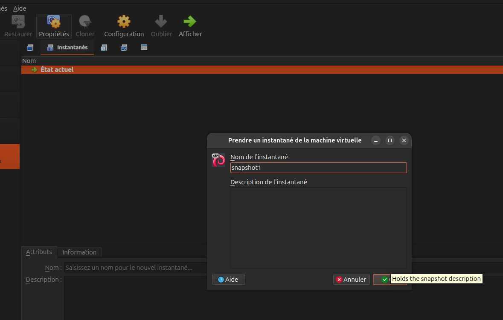
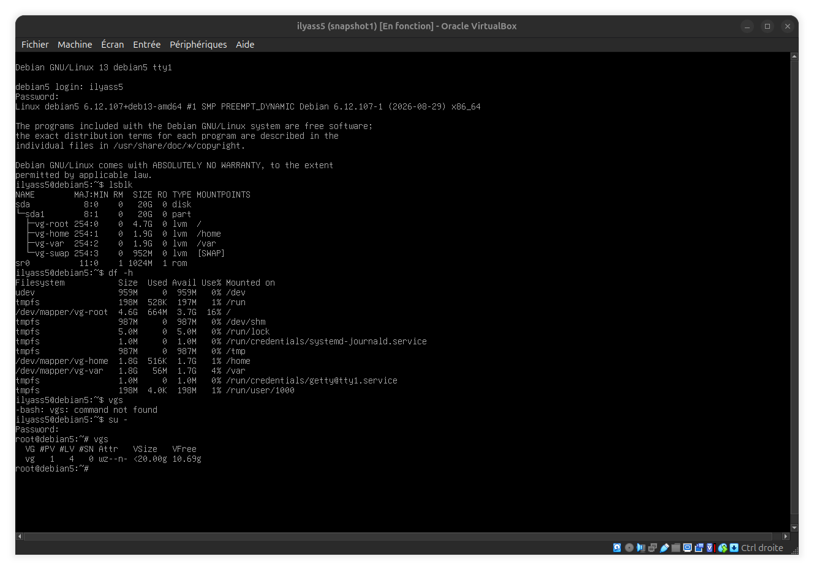
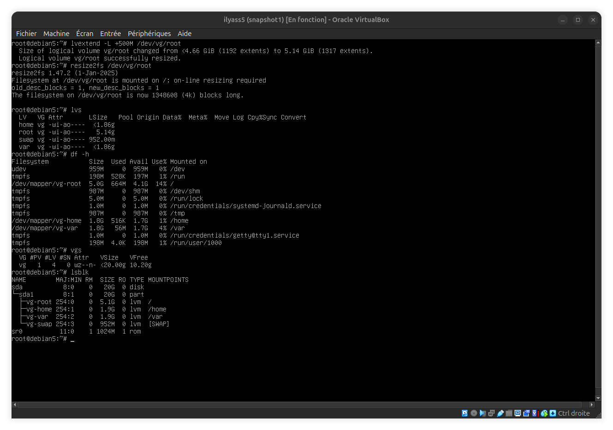

This linux consists of installing and configuring a minimal Debian
server in a VirtualBox (VM).     
the server is configured with: 
   * no desktop environment      
   * LVM storage  
   * separate logical volumes for `/`, `/home`, `/var` and swap   
   * a static IPv4 address 
   * DNS configuration  
   * a custom continuously running `systemd` service
   * persistent service logs in the system journal
   * boot-time analysis with `systemd-analyze`

the goal of this document is to provide a reproducible runbook that another poeple can follow to rebuild the same server.

## Installation   

   this is step by step, the installation process used as the base for this linux project.    
   * install VirtualBox
   * download the [Debian ISO](https://www.debian.org/download)
   * create a new VM
   * allocate a virtual disk of at least 20-25 GB 
   * select the Debian ISO
   * disable unattended installation
   * start the VM and boot from the Debian ISO
   * select the installation language
   * configure the location
   * configure the locale
   * configure the keyboard
   * if the automatic DHCP configuration fails skip it for later
   * configure the hostname
   * set the root password
   * create the normal user account
   * configure the timezone
   * select manual partitioning
   * create a new empty partition table
   * configure the disk using LVM
   * create a physical volume (PV) on the partition dedicated to LVM
   * create a volume group (VG) named `vg`
   * create logical volumes(LV) for `/`, `/home`, `/var` and swap
   * assign the appropriate filesystem (ext4) and mount point to each logical volume:
      - root: 5 GB, ext4, mounted on `/`    
      - home: 2 GB, ext4, mounted on `/home`      
      - var: 2 GB, ext4, mounted on `/var`  
      - swap: 1 GB, used as swap   
      - leave the remaining space unallocated in the volume group (VG)  
   * write the partition changes to disk  
   * configure the apt mirror (can be skipped)
   * decline the package usage survey
   * select software to install: uncheck "Debian desktop environment", keep only "standard system utilities"
   * install GRUB 
   * finish the Debian installation with minimal system packages installed
   * take a VM snapshot immediately after the clean install
   * verify LVM configuration with `lsblk`, `df -h`, and `vgs` (to confirm free extents remain in the VG)

   
   

## volume size justification

   * `/` root filesystem

      This volume stores the operating system and the main system files. if it runs out of space, the system may   
      have problems installing packages or performing normal operations.    

   * `/home`

      this volume stores users personal files and configuration files. keeping it separate from `/` prevents user    
      files from using all the space available on the root filesystem. if `/home` becomes full, users may no longer   
      be able to create or save files.    

   * `/var`

      this volume contains data that changes while the system is running, such as logs, caches and other service data.  
      if it becomes full, some services may stop working correctly and new log entries may not be written.     

   * `swap`

      Swap provides additional disk space that can be used when the available RAM is low. it is configured as a separate         
      LVM logical volume so its size can be managed independently from the other filesystems. if swap becomes full while      
      RAM is also exhausted, the system may start terminating processes because there is no more available memory.

   Not all the space in the volume group (VG) is allocated during installation. the remaining free space can be checked       
   with the `vgs` command. Keeping some free extents in the VG makes it possible to extend a logical volume later without     
   repartitioning the disk.      

   growing a logical volume and its filesystem can be done while the filesystem is mounted, without unmounting it or losing      
   existing data. Shrinking is more complicated: for ext4, the filesystem must first be unmounted. Because of this, it is        
   useful to leave some free space in the volume group and increase the logical volumes later when more space is actually     
   needed, instead ofallocating too much space during installation.     

   let's now demonstrate how to extend a logical volume (LV) while the system is running, without unmounting the filesystem      
   or losing existing data. first, check the current storage state with the `lvs`, `df -h` and `vgs` commands. Then, extend      
   the root logical volume by 500 MB with: `lvextend -L +500M /dev/vg/root`.     

   at this point, the logical volume is larger, but the filesystem itself has not yet been resized. Let's now grow the ext4 filesystem with:       
   `resize2fs /dev/vg/root`      

   finally, check the new size with `lvs` and `df -h`. Some free space must remain in the volume group before extending a     
   logical volume, which is why keeping unused space in the VG during installation is useful.

   